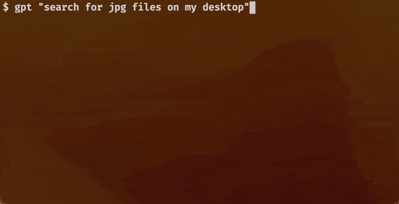
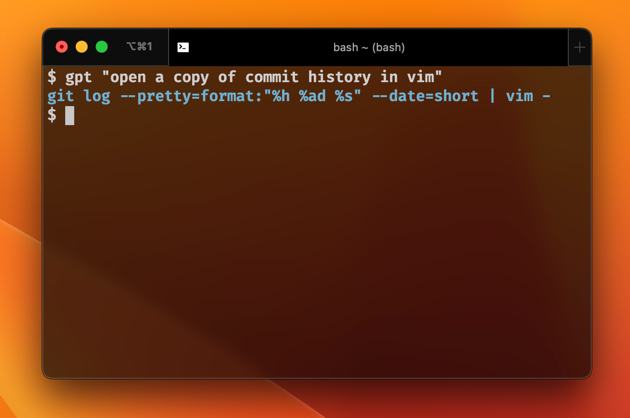
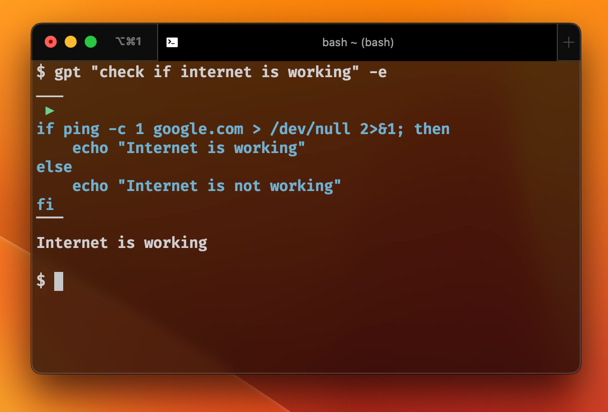
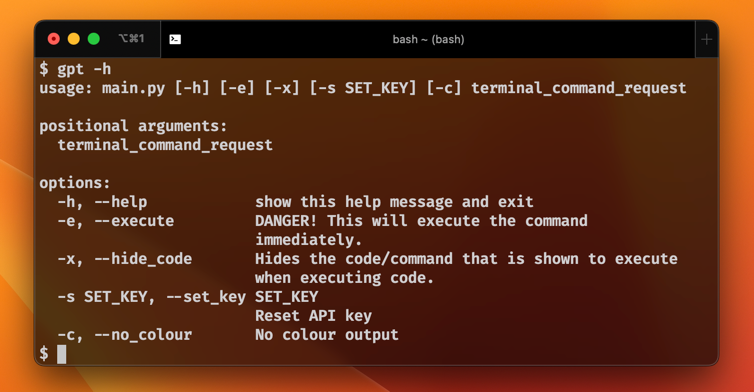

# GPT-CLI-Assistant
## Use AI to make terminal commands!
Always forgetting how to use the terminal like me? Well no more!



## Requirements

* Basic shell knowledge
* Python 3
* Mac or Linux
* Bash, Zsh, or Fish


## Quick Start 🏎️

Run the following:
```
git clone https://github.com/hunterunger/gpt-cli-assistant.git
cd gpt-cli-assistant
python3 -m pip install -r requirements.txt
python3 main.py "check what shell im using"
```

It will then prompt you to set up your API key with [OpenAI](https://openai.com/api/).

Also, it will give you an alias snippet for Alias Setup. 

If you get an output like `echo $SHELL`, it's working!

## Alias Setup 🔩

### Set up your alias

Run `echo $SHELL` to check your shell.
Then run `echo $PWD` to get it's absolute path or use the snippet from earlier.

#### If you're using BASH:

```
echo 'alias gpt="python3 ~/path/to/main.py"' >> .bashrc 
```

#### If you're using ZSH:

```
echo 'alias gpt="python3 ~/path/to/main.py"' >> .zshrc 
```

#### If you're using FISH:

```
function gpt
    python3 ~/path/to/main.py $argv
end
funcsave gpt
```

---

Now you should be able to run
```
gpt "check what shell I'm using"
```

# Usage 🥧

### Simple usage:

`gpt "your request in simple english"`

This will simply output the command to accomplish the requested task.


### Automatic Execution

Add `-e` to automatically run the command.

`gpt "your request in simple english" -e`

This will run the command instantly. 


### More help

Run `gpt -h` to get more commands and info.


## Tips 😎

* Questions are cached so you can re-run the same command without using additional api requests
* Make commands like `gpt "list hidden files"` and NOT like `gpt "make a command to list files"`
* Try long, multi-step commands like `gpt "save commit history to a file, then search the file for a commit with the word 'beta', then open it in vim"`
